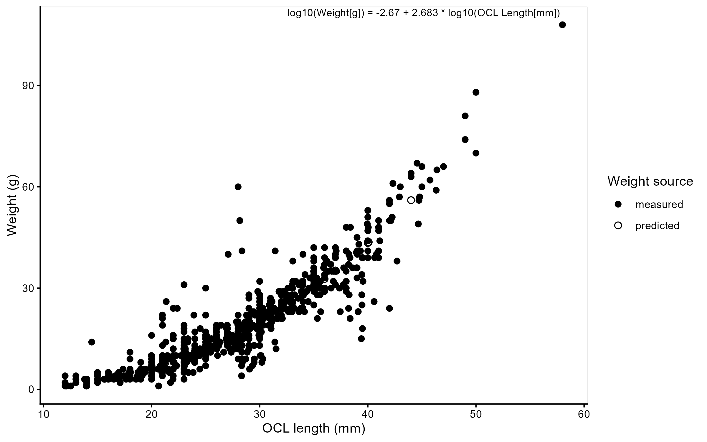

```{=latex}
\clearpage
\providecommand{\chaptermark}[1]{}
\ifcsname c@chapter\endcsname
\setcounter{chapter}{5}
\setcounter{figure}{0}
\setcounter{table}{0}
\setcounter{section}{0}
\addcontentsline{toc}{chapter}{\protect\numberline{5}Rock Piles as K\={o}ura Habitat}
\chaptermark{Rock Piles as K\={o}ura Habitat}
\fi
\providecommand{\thechapter}{5}
\thispagestyle{empty}
\begin{tikzpicture}[remember picture, overlay]
  \begin{scope}
    \clip ([yshift=-7cm]current page.north west)
          rectangle ([yshift=4.5cm]current page.south east);
    \node[inner sep=0pt, anchor=north]
      at ([yshift=-7cm]current page.north)
      {\includegraphics[height=18.2cm]{images/ch5_cover.jpg}};
  \end{scope}
  \fill[black]
    (current page.north west) rectangle ([yshift=-7cm]current page.north east);
  \node[color=thesissand, align=left,
        font=\fontsize{13}{16}\selectfont\sffamily, anchor=west]
    at ([xshift=1.5cm, yshift=-1.5cm]current page.north west)
    {Chapter \thechapter};
  \node[color=white, text width=0.85\paperwidth, align=left,
        font=\fontsize{22}{28}\selectfont\bfseries\sffamily, anchor=west]
    at ([xshift=1.5cm, yshift=-4cm]current page.north west)
    {Rock Piles as K\={o}ura Habitat};
  \node[color=white, text width=0.85\paperwidth, align=left,
        font=\fontsize{10}{13}\selectfont\itshape\sffamily, anchor=north west]
    at ([xshift=1.5cm, yshift=-5.0cm]current page.north west)
    {Stone pile refuges in an Aotearoa New Zealand lake: early benefits for threatened crayfish but not their invasive predator};
  \fill[black]
    (current page.south west) rectangle ([yshift=4.5cm]current page.south east);
  \node[color=white, text width=0.85\paperwidth, align=left,
        font=\fontsize{9}{13}\selectfont\sffamily, anchor=west]
    at ([xshift=1.5cm, yshift=3.2cm]current page.south west)
    {Olivier V.\ Raven, Ian A.\ K.\ Kusabs, Robin Holmes, Francis J.\ Burdon \& Deniz Özkundakci};
  \node[color=thesissand, text width=0.85\paperwidth, align=left,
        font=\fontsize{9}{13}\selectfont\itshape\sffamily, anchor=west]
    at ([xshift=1.5cm, yshift=1.5cm]current page.south west)
    {Journal of Applied Ecology--- In preparation};
\end{tikzpicture}
\null
\clearpage
```

::: {.content-visible when-format="docx"}
Chapter 5 Rock Piles as Kōura Habitat
Stone pile refuges in an Aotearoa New Zealand lake: early benefits for threatened crayfish but not their invasive predator

{fig-align="center" width=15cm}

Olivier V. Raven, Ian A. K. Kusabs, Robin Holmes, Francis J. Burdon & Deniz Özkundakci

*Journal of Applied Ecology* — In preparation


:::

::: {.content-visible when-format="html"}
```{r}
#| label: ch5-hero
#| echo: false
#| output: asis
#| eval: !expr knitr::is_html_output()
.i <- file.path(dirname(knitr::current_input(dir = TRUE)), "05_stone_piles_rotoiti", "images", "ch5_cover.jpg")
if (file.exists(.i)) cat(sprintf('<div class="ch-hero-wrap"><div class="ch-hero-fade"></div><div class="ch-hero-text"><span class="ch-eyebrow">Chapter 5</span><span class="ch-hero-title">Rock Piles as Kōura Habitat</span></div></div>', knitr::image_uri(.i)))
```

# Chapter 5 Rock Piles as Kōura Habitat {.unnumbered .ch-page-heading}
:::

```{r}
#| label: start-ch5
#| include: false

chapter_dir <- normalizePath(file.path(dirname(knitr::current_input(dir = TRUE)), "05_stone_piles_rotoiti"))
if (!dir.exists(chapter_dir)) chapter_dir <- normalizePath(dirname(knitr::current_input(dir = TRUE)))
fig_labels <- c("fig-cpue-trends", "fig-convergence-plot", "fig-forest-plot",
                 "fig-length-weight-ch5", "fig-descriptive-context")
out_dir <- file.path(chapter_dir, "outputs")
dir.create(out_dir, showWarnings = FALSE, recursive = TRUE)

parent_knit_env <- knitr::knit_global()

qmd_lines <- readLines(file.path(chapter_dir, "analysis.qmd"), warn = FALSE)
in_r_chunk <- FALSE
r_lines <- character(0)
for (ln in qmd_lines) {
  if (grepl("^```\\{[rR]", ln)) { in_r_chunk <- TRUE; next }
  if (grepl("^```", ln) && in_r_chunk) { in_r_chunk <- FALSE; next }
  if (in_r_chunk) r_lines <- c(r_lines, ln)
}
r_lines <- c(
  paste0(".chwd <- setwd(", deparse(chapter_dir), ")"),
  r_lines,
  "setwd(.chwd)", "rm(.chwd)"
)
tmp_r <- file.path(chapter_dir, ".analysis_tmp.R")
writeLines(r_lines, tmp_r)
eval(parse(file = tmp_r, encoding = "UTF-8"))
unlink(tmp_r)
out_dir <- file.path(chapter_dir, "outputs")

if (!all(file.exists(file.path(out_dir, paste0(fig_labels, ".png"))))) {
  .old_wd <- setwd(chapter_dir)
  knitr::knit(file.path(chapter_dir, "analysis.qmd"), output = tempfile(), quiet = TRUE, envir = parent_knit_env)
  setwd(.old_wd)
  for (lbl in fig_labels) {
    src <- knitr::fig_chunk(lbl, "png")
    if (file.exists(src)) file.copy(src, file.path(out_dir, paste0(lbl, ".png")), overwrite = TRUE)
  }
}
input_dir <- normalizePath(dirname(knitr::current_input(dir = TRUE)))
if (input_dir != chapter_dir) {
  thesis_out <- file.path(input_dir, "outputs")
  dir.create(thesis_out, showWarnings = FALSE, recursive = TRUE)
  file.copy(list.files(out_dir, full.names = TRUE, pattern = "\\.(png|jpg)$"), thesis_out, overwrite = TRUE)
}
knitr::opts_knit$set(root.dir = chapter_dir)

ps  <- readr::read_csv(file.path(chapter_dir, "outputs", "tbl-power-scalars.csv"),
                       show_col_types = FALSE)
pwr <- function(key) ps$value[ps$key == key]

psi_w <- readr::read_csv(file.path(chapter_dir, "outputs", "tbl-psi-warm.csv"),
                          show_col_types = FALSE,
                          col_types = readr::cols(.default = readr::col_character()))
psi_extract <- function(data, col) {
  vals <- as.numeric(stringr::str_extract(data[[col]], "^[0-9.]+"))
  c(min = round(min(vals) * 100), max = round(max(vals) * 100))
}
psi_before_summer <- psi_w |> dplyr::filter(Period == "Before", Season == "Summer")
psi_after_summer  <- psi_w |> dplyr::filter(Period == "After",  Season == "Summer")
before_rng <- psi_extract(psi_before_summer, "ψ (mean [95% CrI])")
after_rng  <- psi_extract(psi_after_summer,  "ψ (mean [95% CrI])")
```


## Abstract {.unnumbered}
1.	Kōura (*Paranephrops planifrons*), Aotearoa New Zealand’s endemic freshwater crayfish, have declined by up to 96 % in Lake Rotoiti (Te Arawa Lakes, Rotorua), driven by predation from the invasive brown bullhead catfish (*Ameiurus nebulosus*), thermal stratification, and invasive macrophytes that compress suitable habitat into the shallow littoral zone. Because these stressors cannot be removed at the lake scale, adding structural refuge may be one of few practical management options.
2.	We tested whether stone pile structures deployed in the littoral zone of Lake Rotoiti could provide structural refuge for kōura from predation. Kōura and catfish were monitored at five stone piles, five control, and five paired natural rocky reference sites for 18 months using a quasi before-after control-impact (quasi-BACI) design, with kōura occupancy modelled using a Bayesian framework that incorporated detection probabilities from baited traps and fyke nets.
3.	Stone pile construction produced no statistically significant change in kōura abundance, biomass, or occupancy relative to controls, but effects consistently trended positive across models; a simulation-based power analysis showed the study was underpowered to detect the observed effect size, given high pre-construction occupancy (81–89 %) at all site types and only five site pairs.
4.	Kōura use of stone piles was strongly seasonal: catch rates at stone pile and control sites fell in winter as kōura withdrew to deeper water, while reference sites remained stable. Catfish showed no comparable attraction to stone piles in any season or model.
5.	*Synthesis and applications*. Stone piles show early, consistent evidence of benefiting a threatened native crayfish without benefiting its invasive predator and are most valuable when habitat compression and predation pressure peak together in summer and autumn, conditions expected to intensify under climate warming. This study establishes a tested, scalable construction and consenting methodology that lake managers can deploy as an interim refuge-based tool while catfish eradication remains unachievable at the lake scale; we recommend continued monitoring beyond three years and trialling connected, corridor-style structures rather than isolated piles.

## Introduction
Freshwater biodiversity is declining faster than any other biome, with one quarter of freshwater fauna now threatened with extinction [@Sayer2025]. Among the most endangered are freshwater crayfish, with 32 % of species assessed as threatened globally due to habitat loss, invasive species, and declining water quality [@Richman2015]. As keystone species and ecosystem engineers, crayfish play crucial roles in nutrient cycling, bioturbation, and food web dynamics, and their loss can have cascading consequences for freshwater ecosystems [@Momot1995; @Collier1997; @Parkyn2001]. In Aotearoa New Zealand, these pressures converge on kōura (*Paranephrops planifrons* White, 1842), an endemic freshwater crayfish now facing rapid population decline in lakes that have long supported some of the largest customary kōura fisheries in the country [@Hiroa1921; @Kusabs2009].

Kōura populations in Lake Rotoiti, located in the Rotorua Te Arawa Lakes region of the North Island of Aotearoa New Zealand (hereafter Aotearoa), have declined by up to 96 % over the past two decades [@Kusabs2026]. This collapse has virtually ended customary harvest practices for Te Arawa iwi (Māori tribal group) who are hunga tiaki (traditional custodians) of the lake [@Kusabs2015a]. The decline in kōura numbers is driven by multiple interacting stressors that compound over time in different parts of the lake [@Lee2025; @Kusabs2026]. The invasive brown bullhead catfish (*Ameiurus nebulosus* Lesueur, 1819, hereafter catfish), confirmed in Lake Rotoiti in 2016 [@Francis2019; @Grayling2020], preys directly on kōura and suppresses their foraging through non-consumptive ‘fear’ effects [@Raven2026a]. Predation pressure from catfish is compounded by additional stressors that constrain where in the lake kōura can seek refuge from this invasive predator [@Kusabs2026]. 

During the day, kōura shelter in complex rocky habitat and in deeper water to avoid predation [@Jowett2008; @Kusabs2015b], moving out of both at night to forage in the productive littoral zone [@Devcich1979]. The importance of deep-water refuge is shown in Lake Taupō, where kōura persist at a depth even in the presence of catfish because the lake remains oxygenated below the thermocline [@Kusabs2015c; @Verburg2019]. In Lake Rotoiti, this deep refuge becomes anoxic during summer stratification and unavailable for kōura, compressing the zone of liveable habitat into the shallow littoral margins [@Kusabs2026], precisely where catfish are most active [@Dedual2002; @Blanchfield2026]. Dense beds of invasive macrophytes further restrict kōura movement through this compressed zone and intensify oxygen depletion during die-off events [@Vincent1984; @Hamilton2005; @Kusabs2009]. Catfish pressure and thermal stratification are expected to only strengthen with predicted climate scenarios [@Woolway2021; @Lee2025], making kōura habitat compression and predation pressure progressively more severe. 

The compression of suitable habitat and subsequent concentration of kōura into the littoral zone makes the quality of nearshore lacustrine habitats increasingly important for remaining populations. In stream environments, kōura are positively associated with structurally complex habitats including bank undercuts, woody debris, leaf litter, and coarse substrates [@Usio2000; @Parkyn2004; @Jowett2008; @Parkyn2009]. In lake environments, benthic substrate characteristics are a stronger predictor of kōura distribution than nutrient enrichment or predator abundance [@Kusabs2015b], and kōura are positively associated with coarse substrates and riparian vegetation [@Raven2026b]. Coarse rocky substrate provides refugia from predators and shelter during moulting [@Streissl2002]. Experimental studies confirm that shelter availability directly reduces catfish predation on crayfish [@Adams2007; @Zhao2024], and kōura increase refuge use in the presence of catfish compared to native predators [@Raven2026a], emphasising the importance of shelter availability for kōura populations. Shelter availability is likely a limiting factor for kōura in Lake Rotoiti, where the majority of the shoreline is sandy with dense beds of introduced macrophytes and little rocky structure. Adding rocky substrate to soft-bottomed lake areas has been shown to significantly increase crayfish abundance [@Johnsen2008], and increasing structural complexity in streams improves crayfish restocking success [@Huolila1997]. Deploying habitat enhancement structures that add structural complexity in the littoral zone could potentially be a practical way to restore kōura populations in Lake Rotoiti.

In this study habitat enhancement structures in the shape of stone piles were deployed along the shoreline of Lake Rotoiti to investigate the ability of the structures in providing additional habitat for kōura to live and hide from predators. Kōura presence, abundance, and biomass were monitored at stone pile, control, and reference sites over 18 months. We predicted that kōura occupancy, abundance and biomass would increase more rapidly at the stone pile sites than at control sites, as intense catfish predation pressure in the littoral zone was expected to compel kōura actively toward available refuge structures. We further predicted that kōura abundance would continue to increase progressively after construction, at least within the first 18 months, and that catfish would instead show seasonal patterns of shoreline use rather than a construction-driven trend [@Barnes1996; @Dedual2002; @Blanchfield2026]. Finally, we predicted that stone pile sites would progressively converge toward kōura densities observed at natural rocky reference sites, and that catfish would not exhibit a similar pattern.

## Materials and Methods
### Study location and construction
Lake Rotoiti (-38.03, 176.42) is a warm monomictic mesotrophic lake located in the Rotorua Te Arawa Lakes region of the North Island of Aotearoa (34 km², maximum depth 128 m). The lake stratifies for approximately nine months a year ([@fig-lake-conditions]{.content-visible when-format="pdf"}[Fig. S1]{.content-visible unless-format="pdf"}), with pronounced thermal stratification compressing oxygenated habitat into the shallow littoral zone during summer and autumn. Since 2008, nutrient-rich inflows from Lake Rotorua have been diverted toward the Kaituna River via the Ōhau Channel diversion wall to improve water quality in Lake Rotoiti [@Hamilton2005; @Prentice2026]. Lake level is regulated by a weir at the outlet of the Kaituna River, providing a stable and controlled water level throughout the year. Catfish are present throughout the lake but occur in particularly high concentrations in Te Weta Bay on the Northwest side of the lake [@Francis2019]. Five stone pile sites were selected alongside the lake shoreline based on accessibility and landowner approval (@fig-sites). At each stone pile site, a paired control site was established 50 m along the shoreline, matched for habitat characteristics e.g., water depth, substrate type and vegetation cover. Five naturally occurring rocky shoreline locations, with each two monitoring sites 50 m apart were selected as reference. In total, 20 sites of each 150 m² (15 × 10 m) were monitored seasonally over 18 months. Physical characteristics of all sites are summarised in @tbl-site-overview. Baseline monitoring was conducted in February 2025 prior to stone pile deployment, which occurred the following week. Stone piles were constructed from locally sourced quarry rock (Manawahe Stone and Quarry, ~25 km from the lake) with a diameter ranging from 85 - 315 mm (mean = 173 mm). At each of the five stone pile sites, three stone piles were arranged horizontally along the shoreline by hand from the shore. Stone pile design was informed by mesocosm experiments demonstrating kōura preference for enclosed stone structures (unpublished data). Stone piles were positioned approximately `r round(mean_dist_shore, 1)` m from shore at a mean depth of `r round(mean_depth, 2)` m and with a mean area of `r round(mean_area, 1)` m².

### Monitoring
Physical, chemical, and biological parameters were recorded at each site during each monitoring round. Static site characteristics including substrate composition, slope to depth contour, riparian vegetation, overhanging tree cover, and wood cover were visually estimated during baseline monitoring only, as these were not expected to change substantially over the monitoring period. Substrate composition was visually estimated by a single observer walking around each site and using an underwater viewing chamber, categorising bedrock, boulders (>256 mm), cobble (64–256 mm), gravel (2–64 mm), sand (0.063–2 mm), mud (<0.063 mm), and organic matter [@Wentworth1922]. A substrate index, that indicates suitability for kōura, was calculated from these estimates [@Jowett1990; @Jowett2008]:

$$
\begin{aligned}
\text{Substrate index} &= 0.08 \times \text{bedrock} + 0.07 \times \text{boulders} \\
&\quad + 0.06 \times \text{cobble} + 0.04 \times \text{gravel} + 0.03 \times \text{sand} \\
&\quad + 0.02 \times \text{organic matter} + 0.01 \times \text{mud}
\end{aligned}
$$
Coarser substrates were assigned higher weights as they provide greater interstitial pore space and stable structures used by kōura [@Usio2000; @Nystrom2006].

After stone pile construction, measurements of the size and dimensions of each structure were taken. The post-construction substrate index for stone pile sites was recalculated using each site’s combined stone-pile footprint area, expressed as a percentage of the 150 m² site area and treated as 80 % cobble and 20 % boulders displacing an equivalent area of sand, to reflect their contribution to substrate complexity. Slope was assessed as the horizontal distance from the shoreline to the 20 m depth contour, derived from bathymetric maps and measured in a projected coordinate system (NZTM2000; EPSG:2193).

Seasonal variable parameters were recorded at every monitoring round and included aquatic vegetation cover (emergent and submerged macrophytes). Chemical parameters included water temperature (°C), dissolved oxygen (mg L$^{-1}$), and conductivity ($\mu$S cm$^{-1}$) were measured using a YSI ProSolo meter (Pro2030, YSI Inc., Yellow Springs, OH, USA). pH was measured using a handheld pH meter (EC-PCTestr35, Eutech Instruments). 

Kōura and fish were sampled every monitoring round using two single-winged, double-throated fyke nets (600 mm high D-shaped entrance hoop) and two collapsible bait traps (480 × 250 mm; two 50 mm entrance openings) baited with catfish flesh [@Joy2013; @MacNeil2025]. Fyke nets were placed perpendicular to the shoreline outside of the stone pile structures or at 10 m intervals, with bait traps positioned between them. All equipment was deployed simultaneously at each site for a 24-h period. Captured kōura were measured for orbital carapace length (OCL) using a digital calliper (0.01 mm precision; 150 mm) and for wet mass using a digital scale (± 1 g; 5 kg capacity, Anko Brand, Kmart Group, Mulgrave, VIC, Australia). Catfish and other fish species, were recorded for abundance, measured for total length, and weighed for wet mass. Catch per unit effort (CPUE) and biomass per unit effort (BPUE) were calculated for all kōura and fish based on the number of nets and traps deployed at each site per monitoring round, standardised by soak time [@Kusabs2015b]. Kōura weights were unavailable for `r predicted_n` individuals because of scale failure and were therefore estimated from a log₁₀–log₁₀ length–weight regression fitted to individuals with both measurements (n = `r measured_n`), following standard approaches for weight length relationships in aquatic organisms [@fig-length-weight-ch5]{.content-visible when-format="pdf"}[Fig. S2]{.content-visible unless-format="pdf"} [@Froese2006]. Predicted values were back-transformed with a lognormal bias correction factor $10^{0.5 \sigma^2}$ [@Quinn2002].

$$
\log_{10}(\text{Weight [g]}) = `r round(a, 3)` + `r round(b, 3)` \times \log_{10}(\text{OCL length [mm]})
$$

### Data analysis
Data analysis was a three-part process, the first assessed baseline equivalence between stone pile, control, and reference sites before construction, the second assessed the impact of stone pile construction and after-construction trajectory on kōura and catfish occupancy, abundance, and biomass, and the third assessed whether stone pile sites converged toward reference sites and if reference sites remained stable over time. All analyses were conducted in R (version 4.6.1; @RCoreTeam2026) using the glmmTMB and emmeans packages [@Brooks2017; @Lenth2017].

Covariate selection for all models followed a consistent procedure. Corrected Akaike Information Criterion (AICc) values for each base model were compared against models with additional covariates (temperature, season, substrate index, maximum effective fetch, or wave energy proxy) added at a time, and a covariate was retained only when it reduced AICc by more than two units relative to base model [@Burnham2002]. Robustness and sensitivity for all models were assessed by evaluating uniform distribution, dispersion and outlier rate using the DHARMa package [@Hartig2016]. Across the full set of models, the Benjamini–Hochberg correction method was applied to control the false discovery rate within each of the three analysis components.

Site variation before stone pile construction was assessed using paired Wilcoxon signed-rank tests to compare stone pile sites with their paired control sites, and unpaired Wilcoxon rank-sum tests to compare stone pile sites with reference sites. This was done for response variables (water quality, substrate, and kōura and catfish CPUE and BPUE) to confirm that the stone pile and control sites were equivalent before construction, and to characterise the difference between stone pile and reference sites. To further assess baseline equivalence, generalised linear models (GLMs) were fitted to test whether kōura and catfish CPUE and BPUE differed between site type (stone pile / control) and between the two reference sites (reference 1 / reference 2) using a Tweedie family with a log link. Following the covariate selection procedure, temperature was included in the catfish models comparing reference sites, as the base model failed to converge and temperature was required for numerical stability.

The second component of the analysis tested construction impact relative to control sites using a quasi-before-after, control-impact (quasi-BACI) design [@Underwood1994], and separately tested after-construction trajectory of kōura and catfish populations. The design is quasi-BACI because only a single pre-construction monitoring round was possible. The quasi-BACI design compared one pre-construction monitoring round with six post-construction monitoring rounds using generalised linear mixed effects models (GLMMs) to test the effect of stone pile construction on kōura and catfish occupancy, abundance, and biomass. Time period (before / after) and site type (stone pile / control) were included as an interaction term, monitoring round as a covariate and site nested within control-impact pair as a random effect. Occupancy was modelled using a binomial GLMM, and abundance and biomass using a Tweedie GLMM with a log link; fetch was retained as a covariate in the catfish model. The post-construction trajectory models used the same response variables, families, covariate, and random effect structure, but with site type and monitoring round included as an interaction term in place of the before / after comparison. 

The third component of the analysis assessed whether stone pile sites converged toward reference sites over time, and whether reference sites themselves remained stable. Kōura and catfish abundance and biomass were tested using GLMMs with site type (stone pile / reference) and monitoring round included as an interaction term, and site number as a random effect, using a Tweedie family with log link; temperature was retained as a covariate in the catfish model. Reference site stability was tested in GLMMs with site type (reference 1 / reference 2) and monitoring round as an interaction term, and site nested within pair as a random effect, again using Tweedie family with log link; season was retained as a covariate in the kōura model and temperature was retained as a covariate in the catfish model.

To complement the GLMM abundance analysis, kōura site-level occupancy was estimated using a two-method occupancy model fitted within a Bayesian framework. Because bait traps and fyke nets provide independent and simultaneous detection opportunities at each site, true site occupancy could be separated from imperfect and method-specific detection probabilities. A custom Stan observation model was implemented using the brms package [@Burkner2017; @Burkner2018] using cmdstanr [@Gabry2025] to estimate true occupancy and detection probabilities for baited traps and fyke nets via logit links. Standardised water temperature was included as the covariate for detection probability. Three occupancy sub-models were fitted. A full model across all monitoring rounds served as baseline comparison. A summer-only model and a warm-season model (summer and autumn combined) were fitted to focus on the period of highest thermal stratification, when kōura are known to disproportionately occupy nearshore littoral habitats [@Kusabs2026] and when catfish predation pressure is highest in the areas where the stone piles are located [@Blanchfield2026]. The warm-season model maximises ecological relevance, while retaining a tractable formula with season as an additive covariate. All models were run with four chains of 4000 iterations (1500 warmup) and convergence was assessed using R̂ values (threshold < 1.01) and bulk effective sample sizes (threshold > 400) [@Vehtari2021]. Divergent transitions were rare in all models (≤ 9 of 10,000 post-warmup draws) and considered negligible given the otherwise strong convergence diagnostics.

A simulation-based power analysis was conducted to quantify the sample size required for statistical detection of the BACI effect under the observed effect size and variance structure, and to put the non-significant results in perspective relative to study design rather than true absence of effect. For each analysis the occupancy and abundance, datasets were simulated across a grid of scenarios varying in number of site pairs (3-30) and after-period monitoring rounds (2-12). For the occupancy BACI, simulated binary detection data were generated using values from the warm-season occupancy model posterior means, and each simulated dataset was analysed using a logistic GLMM (lme4; @Bates2015). For the CPUE BACI, simulated abundance data were generated using fixed effects and variance components from the kōura abundance BACI model, using a log-normal approximation to the Tweedie distribution, and each dataset was analysed using a linear mixed model fitted to a log-transformed CPUE. Statistical power was estimated as the proportion of simulations (300 per scenario) in which the model’s 95 % confidence interval for the BACI coefficient excluded zero in the positive direction.

## Results
Kōura presence was detected at stone pile sites within three months of construction, with occupancy and abundance trending consistently higher at stone pile sites than paired control sites throughout the 18-month post-construction period, though this difference did not reach statistical significance. Results across all models and response variables are summarised in @fig-forest-plot and [@tbl-models-summary-full-supp]{.content-visible when-format="pdf"}[Table S1]{.content-visible unless-format="pdf"}. 

### Baseline equivalence
Pre-construction, kōura abundance and biomass did not differ significantly between stone pile and paired control sites ([@tbl-baseline-combined-supp]{.content-visible when-format="pdf"}[Table S2]{.content-visible unless-format="pdf"}), confirming baseline equivalences (`r fmt_p(stat("M1aak", "Site_type_detailStone_pile", "p_adj_BH"))` and `r fmt_p(stat("M1abk", "Site_type_detailStone_pile", "p_adj_BH"))`). Kōura abundance (`r fmt_p(stat("M1bak", "Site_type_detailReference_2", "p_adj_BH"))`) and biomass (`r fmt_p(stat("M1bbk", "Site_type_detailReference_2", "p_adj_BH"))`) did not differ between reference sites. Catfish abundance (`r fmt_p(stat("M1bac", "Site_type_detailReference_2", "p_adj_BH"))`) and biomass (`r fmt_p(stat("M1bbc", "Site_type_detailReference_2", "p_adj_BH"))`) likewise did not differ between stone pile and control sites pre-construction. However, catfish abundance and biomass were significantly higher at Reference 1 than Reference 2 (`r fmt_p(stat("M1bac", "Reference_2", "p_adj_BH"))` and `r fmt_p(stat("M1bbc", "Reference_2", "p_adj_BH"))`, respectively), despite both sites having comparable rocky substrate. This suggests catfish distribution varies considerably between nearby sites with similar habitat characteristics.

### Construction impact (BACI) and post-construction trajectory
Stone pile construction produced no detectable step-change in kōura abundance, biomass, or occupancy relative to paired control sites over the 18-month monitoring period following deployment (all *p*~adj~ = `r fmt_num(stat("M2aak", "PeriodAfter:siteStone_pile", "p_adj_BH"))`) (@fig-koura-effect). A matched-season comparison, comparing Summer 2025 (before construction) with Summer 2026 (one year after construction), produced the same conclusion (kōura abundance: `r fmt_p(stat_ms("Kōura", "abundance", p.value))`). Post-construction trajectories did not diverge significantly between stone pile and control sites (all *p*~adj~ = `r fmt_num(stat("M2bak", "siteStone_pile:monitoring_int", "p_adj_BH"))`). Kōura abundance declined significantly across post-construction rounds at control and stone pile sites ($\beta$ = `r fmt_b(stat("M2bak", "^monitoring_int$", "estimate"))`, `r fmt_p(stat("M2bak", "^monitoring_int$", "p.value"))`), with the sharpest decline observed in Winter 2026 (@fig-cpue-trends). Stone pile construction produced no detectable step-change or trajectory divergence in catfish abundance, biomass, or occupancy relative to control sites across any model or time period (@fig-forest-plot).

Kōura occupancy was high across all site types before construction, `r before_rng["min"]`–`r before_rng["max"]` % in summer ([@tbl-psi-warm-supp]{.content-visible when-format="pdf"}[Table S3]{.content-visible unless-format="pdf"}). After construction, occupancy increased marginally at all sites, `r after_rng["min"]`–`r after_rng["max"]` % in summer, thereby limiting our ability to detect a treatment effect. The BACI contrast to compare how much stone pile sites changed relative to control sites was slightly positive, but the credible intervals spanned zero with wide uncertainty (@fig-occ-warm-contrasts), indicating no detectable additional increase at stone pile sites. However, this result likely reflects a measured ceiling rather than biological response. After-treatment contrast showed no significant difference between site types, but the direction of the effect was consistent with early habitat use: stone pile sites showed a positive contrast relative to control sites, while control sites showed a negative contrast relative to reference sites, and stone pile sites were near zero relative to reference sites (@fig-occ-warm-contrasts).

The non-significant BACI results should be interpreted in the context of statistical power. For occupancy, power was near zero across all simulated scenarios (maximum `r scales::percent(pwr("max_occ_power"), accuracy = 1)`), reflecting the ceiling effect leaving no statistical room for a BACI signal ([@fig-power-curves-combined]{.content-visible when-format="pdf"}[Fig. S3]{.content-visible unless-format="pdf"}). Post-construction power analysis showed that achieving 80 % power with the current five site pairs would require an effect size of approximately `r round(pwr("threshold_80"), 2)` log-units, almost `r round(pwr("threshold_ratio"), 0)` times the current observed effect (@fig-trajectory-projection). If the estimated positive trajectory of +`r round(pwr("traj_per_round"), 2)` log-units per seasonal round continues, the effect size may reach this detection threshold within approximately `r round(pwr("rounds_to_80"), 0)` additional monitoring rounds (~`r round(pwr("years_to_80"), 1)` years).

### Convergence toward reference sites and reference stability
Stone pile sites maintained a consistently lower kōura abundance than reference sites throughout the post-construction period, with no significant change in this gap over time ($\beta$ = `r fmt_b(stat("M3aak", "siteStone_pile:monitoring_int", "estimate"))`, `r fmt_p(stat("M3aak", "siteStone_pile:monitoring_int", "p.value"))`; [@fig-convergence-plot]{.content-visible when-format="pdf"}[Fig. S4]{.content-visible unless-format="pdf"}). Kōura abundance declined across monitoring rounds at both stone pile and reference sites ($\beta$ = `r fmt_b(stat("M3aak", "^monitoring_int$", "estimate"))`, `r fmt_p(stat("M3aak", "^monitoring_int$", "p.value"))`). The Winter 2026 monitoring round showed a pronounced decline at stone pile sites (CPUE ≈ 0.7) while reference sites maintained substantially higher abundance (CPUE ≈ 1.7; @fig-cpue-trends), a within-round contrast not captured by the linear trajectory model. Water temperature at Winter 2026 was approximately 1.5°C lower than Winter 2025 but consistent across site types, ruling out temperature as a site-specific driver. Visual inspection of stone pile surfaces during Winter 2026 monitoring revealed substantially greater filamentous algal accumulation compared to earlier rounds ([@fig-stone-piles]{.content-visible when-format="pdf"}[Fig. S5]{.content-visible unless-format="pdf"}). Catfish abundance and biomass showed no significant convergence or divergence between stone pile and reference sites over time (@fig-forest-plot).

## Discussion
Stone pile structures were deployed in the littoral zone of Lake Rotoiti to test whether physical refuge could reduce predation pressure on kōura by invasive catfish. Stone piles produced no statistically significant increase in kōura abundance, biomass, or occupancy relative to paired control sites, but the direction of effect was consistently positive across every response variable and model, and occupancy at stone pile sites converged with occupancy at natural rocky reference sites by the first post-construction summer. Catfish showed no comparable response to stone pile presence in any model, at any site type, or in any season, indicating that stone piles selectively benefit kōura without providing equivalent refuge or foraging opportunity for this invasive predator. A pronounced decline in kōura catch rates at stone pile and control sites in Winter 2026, evidently driven by seasonal redistribution to deeper water rather than habitat abandonment, showed that structural refuge value is itself seasonal and concentrated in the warmer months when catfish predation pressure and habitat compression peak. Together, these results and a formal power analysis indicate that the absence of statistical significance most plausibly reflects limited study duration and sample size rather than genuine ineffectiveness of the intervention.

### Construction effect and statistical power
Kōura catch rates were highly variable across all site types throughout the monitoring period, with wide confidence intervals, likely reflecting genuine biological variability in kōura distribution. This variability may reflect seasonal activity patterns, detection probability changes across monitoring rounds, and natural heterogeneity in littoral zone use, rather than stable site associations. Despite this variability, the Bayesian occupancy model revealed a consistent positive directional trend, with stone pile sites showing higher occupancy than control sites, and occupancy comparable to natural rocky reference sites across both summer and autumn monitoring rounds. Whether this reflects active refuge-seeking driven by catfish predation pressure or gradual colonisation and population expansion into newly available habitats cannot be determined from the current data, but the direction of the response was consistent with the purpose of the structures, yet no statistically significant effect was detected within the 18-month monitoring period.

The absence of a significant effect is most likely explained by a combination of monitoring duration, statistical power, and system dynamics rather than ineffectiveness of the structures. Habitat establishment for freshwater crayfish can be inherently slow. @Johnsen2008 reported that crayfish abundance at a stone addition site took 13 years to reach reference levels, and monitoring periods shorter than two years are often insufficient to detect significant responses to habitat modification [@Testa2011; @Ruh2012; @Pilotto2018]. Following reconstruction of the Lake Rotorua lakefront, which is connected to Lake Rotoiti, kōura showed no meaningful recolonisation after 28 months [@Kusabs2023]. They attributed slow recolonisation to persistent catfish predation pressure and distance from source population, consistent with time scales observed here. The power analysis indicates that five site pairs are insufficient to reliably detect effects of the magnitude observed here within 18 months, establishing a minimum design threshold: future stone pile monitoring programmes should plan for at least three years of monitoring and expect high pre-construction occupancy, leaving little statistical room for a measurable treatment effect. The simultaneous elevation of kōura CPUE across all site types in Autumn 2025 further complicated detection of an early treatment effect in the BACI contrast.

Features of the system itself may also contribute to the weak response. Kōura abundance is highest in lakes without catfish [@Raven2026b], suggesting predation pressure may suppress kōura populations well below the carrying capacity of existing habitat. If so, structural habitat availability may not currently be the primary limiting factor, and a weak or delayed response to habitat addition would be expected. Equally, if kōura are already at carrying capacity of existing rocky habitat, stone piles add new capacity that will only be filled gradually as the population expands, which is unlikely to be detectable within 18 months. In either case, a delayed rather than absent population response would be expected. Isolated stone pile structures may also be difficult for kōura to locate, since distance between isolated habitat patches is a key determinant of colonisation success [@Hanski1998]. Each of these explanations point toward a delayed, rather than absent, population response, and continued monitoring would be the appropriate next step rather than a reassessment of the intervention itself.

### Seasonal dynamics: the Winter 2026 decline
Kōura CPUE at stone pile and control sites fell sharply in Winter 2026, returning to levels close to the pre-deployment baseline from Summer 2025, while reference sites maintained substantially higher abundance. This pattern is consistent with known seasonal migration behaviour across lake depth profiles and kōura activity rates during cooler water temperatures [@Devcich1979]. When lake thermal stratification breaks down in winter, the hypolimnion re-oxygenates and deep-water habitat becomes accessible, allowing kōura to redistribute along the depth gradient [@Devcich1979]. Reduced activity at low water temperatures independently lowers the probability of trap capture [@Devcich1979], and although Winter 2026 was 1.5 °C lower than Winter 2025, this difference was consistent across all site types and therefore cannot explain why reference sites were substantially more resilient to the winter decline than the stone pile sites.

Natural rocky reference sites in this study represent the ecological target for stone pile deployment. Reference sites had established kōura populations, connectivity to deeper waters, and extensive refuge habitat, allowing kōura to maintain littoral presence through winter or return rapidly from deeper refuges as conditions fluctuated. Stone pile sites are isolated structures with less connectivity to deep and extensive refuge habitat, meaning kōura that withdrew in winter had no quick pathway back to the structures. This difference likely explains why stone pile sites maintained consistently lower kōura abundance than reference sites throughout the monitoring period, with no significant convergence toward reference levels. However, kōura occupancy at stone pile sites was comparable to that at reference sites after construction, suggesting that kōura found and used the structures at similar frequency to natural rocky habitat but at lower densities. This distinction between occupancy and abundance likely reflects the early stage of colonisation and the small structural footprint of stone piles relative to the extensive natural rocky habitat at reference sites. These differences are expected to narrow as biofilm succession matures and kōura accumulate at the structures over time.

Extensive filamentous algae growth was observed on the stone pile structures in Winter 2026 but not to the same degree in Winter 2025 ([@fig-stone-piles]{.content-visible when-format="pdf"}[Fig. S5]{.content-visible unless-format="pdf"}), consistent with the seasonal pattern typical for thermally stratified lakes, where winter mixing raises nutrient availability while cooler water suppresses invertebrate grazing, allowing algal mats to accumulate on hard surfaces [@Wetzel2001; @Bonacina2023]. The freshly quarried piles were free from biofilm at deployment and by Winter 2026 supported a diverse meiofaunal assemblage, indicating active succession rather than habitat degradation; algal cover would be expected to decline as grazer activity resumes in spring and summer. Despite the near-zero trap catches in Winter 2026, night spotlighting at two stone pile sites in August 2026 directly observed kōura sheltering within the structures, confirming that low winter catch rates reflect reduced detectability rather than abandonment. Together, these results indicate that stone pile refuge value is inherently seasonal — greatest in summer and autumn, when thermal stratification compresses habitat into the littoral zone and catfish predation peaks, and lowest in winter, when kōura redistribute to deeper water regardless of structure type.

### Catfish: no evidence of attraction to stone piles
Catfish showed their seasonal patterns in littoral zone use, but these were unrelated to stone pile presence. Stone pile construction produced no evidence of catfish attraction or accumulation. Even if catfish were to use stone piles to some degree, the ecological significance of this would be limited given the extensive availability of existing suitable habitat for catfish in Lake Rotoiti, particularly invasive macrophyte beds [@Barnes2003]. The single-site increase in catfish CPUE during Summer 2026 was mirrored by an increase at reference sites and was consistent with lake-wide seasonal redistribution into warm littoral waters rather than any stone-pile-specific event [@Blanchfield2026]. Overall catfish catches remained low throughout the study relative to targeted removal netting in Te Weta Bay, where highest catfish densities are concentrated [@Francis2019]. In autumn, catfish shift to mid-water movement across the lake basin remaining above 15 m depth [@Blanchfield2026], reducing predation pressure on kōura in the littoral zone. This absence of attraction is an important management result in its own right: habitat enhancement can be targeted at a threatened native species without inadvertently improving conditions for its invasive predator.

### Implications for restoration design and monitoring
Predator-prey interactions are shaped by habitat structure, which offers refuge to prey, influences how easily predators locate and capture prey, and alters the costs and benefits of hunting for a predator [@Lennox2025]. This framework applies directly to catfish-invaded lakes, where habitat addition offers a practical lever on that interaction, and rocky environments have been identified as natural multi-threat refugia, capable of simultaneously buffering predation, thermal extremes, and invasive species pressure across a wide range of taxa and ecosystems [@Selwood2020]. In Lake Rotoiti, catfish and thermal stratification — the two primary drivers of kōura decline — cannot be managed at the lake scale: eradication is not currently achievable, and targeted removal in high density areas reduces local pressure without eliminating the lake-wide population [@Dedual2019]. Emerging biotechnologies such as gene drives and host-specific biological control agents may offer future options [@Thresher2014; @Kopf2019; @Teem2020], but these remain experimental, and thermal stratification will continue to intensify under climate warming [@Woolway2021; @Lee2025]. Where the primary stressors cannot be removed, habitat addition becomes one of the few available management tools, and refugia become correspondingly more valuable [@Selwood2020].

The stone piles deployed here were isolated structures, separated from each other and from deeper water by soft sandy substrate. Isolated habitat patches support fewer species and are more vulnerable to local extinction than connected habitats [@Hanski1998], and the Winter 2026 decline is consistent with this limitation: stone piles lacked the connectivity to deep refuge that allowed reference sites to remain stable. Orienting future structures perpendicular to the shoreline, extending through macrophyte beds and into deeper water, could create corridors linking the littoral zone with deeper refugia, allowing kōura to move more freely between depth ranges as conditions change, as they do at reference sites. This design has not been tested but is a promising direction for future deployments, with the addition of potential benefit of suppressing macrophyte growth along the corridor.

The dense algal fouling observed in Winter 2026 also raises a placement question. In sheltered bays, stone piles are protected from wave damage, but algal growth and sediment accumulation could progressively reduce crevice accessibility and refugia value; in more exposed locations, natural scouring could limit fouling, but conditions may be too disturbed to provide effective shelter [@Parkyn2004]. This placement trade-off warrants direct investigation in future deployments, and standardised photography of consistent stone faces each monitoring visit would allow fouling development to be tracked alongside changes in kōura use.

Finally, the five stone pile structures deployed here cannot be expected to drive population-level recovery across a lake of this size on their own. The spatial and temporal scale of the ecosystem responses is typically greater than the scale of the interventions used to produce them [@Minns1996], and scaling from individual stone pile deployment to habitat addition at population-relevant extents is a central challenge in restoration ecology [@Ngwenya2025].

Beyond the ecological results, this study establishes a practical foundation for scaling habitat enhancement in these lakes: the approvals, consents, and construction methodology needed to deploy stone piles have now been tested, with evidence that doing so is unlikely to meaningfully benefit catfish on their own. These outcomes give lake managers a practical, tested option for future large-scale deployment; continued monitoring for at least three years is recommended to determine whether the Winter 2026 decline was a one-off event and whether kōura abundance at stone pile sites continues to build in subsequent spring and summer seasons.

### Conclusion 
Stone pile deployment alone cannot reverse the trajectory of kōura decline in Lake Rotoiti, but it directly addresses the current bottleneck: the shortage of structural refuge in a lake where soft sediment dominates the shorelines and where the two primary stressors, catfish predation and thermal habitat compression, cannot be controlled at the lake scale. Both stressors are expected to intensify under continued climate warming [@Woolway2021; @Lee2025], narrowing the band of habitat available to kōura and increasing, rather than diminishing, the value of structural refugia over time. Establishing refugia before populations decline further may be more effective than waiting until source populations fall below critical densities for recolonisation [@Morelli2016; @Kusabs2026]. The consistent positive directional trend in occupancy, the rapid and clearly seasonal use of the structures, and the developing biological community on the stone pile surfaces together suggest the foundations for a population-level response by kōura are being laid, even though catfish showed no comparable benefit from the structures. Whether this translates into a detectable population-level effect will depend on continued long-term monitoring — the logical next phase of this restoration programme.

## Acknowledgements
We thank Te Arawa Lakes Trust and Te Komiti Whakahaere for the opportunity to study kōura - a taonga (treasured) species. We are grateful to Soweeta Fort-D’ath and William Anaru (Te Arawa Lakes Trust), and Tihini Grant (Ngāti Pikiao). Tāheke Opatia Marae, Te Takinga Marae, and landowners, Piripi Curtis, David McIlraith, Piki Thomas, Haddon Lock, Barnett Vercoe, Richard Vercoe, and Caroline Newton, for granting access to monitoring sites and facilitating fieldwork in Lake Rotoiti. We thank Andy Bruere, Alex Simes, Cory O’Neill, Joe Butterworth, Martin Sarkezi, Mael Marguet, Savio Dsouza, Ethan Morgan, Logan Kallam, Calum MacNeil, and Matt Prentice for assisting with fieldwork and data collection.

::: {.chapter-only}
### Funding statement
This research was supported by the Fish Futures programme funded through a Ministry of Business, Innovation and Employment grant (CAWX2101) with additional funding provided by the Bay of Plenty Regional Council under the Toihuarewa Waimāori - Bay of Plenty Regional Council Chair in Lake and Freshwater Science programme.

### Authors’ contributions
Study conception and design were undertaken by Olivier V. Raven, Ian A. K. Kusabs, Robin Holmes, Francis J. Burdon and Deniz Özkundakci. Fieldwork was executed by Olivier V. Raven. Data analysis was performed by Olivier V. Raven. Ian A. K. Kusabs obtained council and iwi consent and provided local ecological knowledge. Manuscript drafting was led by Olivier V. Raven. All authors contributed to manuscript revision, approved the results, and the final manuscript.

### Use of Artificial Intelligence
Use of Artificial Intelligence: Claude (Anthropic Sonnet 5.0) was used to assist with manuscript editing and language refinement. All content was critically reviewed, and the authors take full responsibility for the final manuscript.

### Declarations
The corresponding author has declared that none of the authors has any competing interests.

### Data availability statement
The code and derived data supporting the findings of this study are openly available on GitHub (https://github.com/OlivierRaven/Stone_Piles_Rotoiti) and a rendered version of the analysis is hosted at https://olivierraven.github.io/Stone_Piles_Rotoiti/. The primary raw dataset is archived on Zenodo (https://doi.org/...). Peer review documents, including the cover letter and reviewer responses, are available in the manuscript repository in the interest of open and transparent science.
:::

## Tables
```{r}
#| label: tbl-site-overview
#| echo: false
#| tbl-cap: "Physical characteristics of stone pile, control, and reference monitoring sites at baseline. Sites 1–10 are stone pile (odd) and paired control (even) sites; sites 11–20 are reference sites. Substrate index is a weighted composite of substrate particle sizes (higher values indicate coarser substrate more suitable for kōura). Slope is the gradient to the 20 m depth contour. Fetch is maximum effective fetch. Vegetation values are visually estimated percentage cover."
ch5_dir <- if (dir.exists("05_stone_piles_rotoiti")) "05_stone_piles_rotoiti" else "."
if (isTRUE(getOption("thesis.is.html")) && knitr::is_html_output()) {
  .rds <- file.path(ch5_dir, "data/derived/widget_site_overview.rds")
  if (file.exists(.rds)) readRDS(.rds) else htmltools::tags$p(htmltools::tags$em("Table not yet built — render analysis.qmd first."), style = "color:#888;padding:1em")
} else if (knitr::is_latex_output()) {
  site_ov <- readr::read_csv(file.path(ch5_dir, "outputs", "tbl-site-overview.csv"), show_col_types = FALSE)
  knitr::kable(site_ov, digits = 2, booktabs = TRUE) |>
    kableExtra::kable_styling(
      latex_options = c("scale_down", "striped", "hold_position"),
      font_size = 8,
      stripe_color = "gray!8"
    )
} else {
  site_ov <- readr::read_csv(file.path(ch5_dir, "outputs", "tbl-site-overview.csv"), show_col_types = FALSE)
  knitr::kable(site_ov, digits = 2)
}
```

## Figures
::: {.content-visible unless-format="html"}
{#fig-sites width=100%}
:::

::: {.content-visible when-format="html"}
```{r}
#| label: fig-sites
#| echo: false
#| eval: !expr knitr::is_html_output()
#| fig-cap: "Map of Lake Rotoiti with monitoring sites coloured by site type: stone pile (red), control (yellow), reference (blue). Click a marker to see the site details."
ch5_dir <- if (dir.exists("05_stone_piles_rotoiti")) "05_stone_piles_rotoiti" else "."
.rds <- file.path(ch5_dir, "data/derived/widget_sites_map.rds")
if (file.exists(.rds)) readRDS(.rds) else htmltools::tags$p(htmltools::tags$em("Interactive map not yet built — render analysis.qmd first."), style = "color:#888;padding:1em")
```
:::


![Effect sizes ($\beta$ ± 95% CI) for the key term of interest across all models, separated by species (columns) and comparison type (rows). Filled points indicate significant effects (*p* < 0.05); open points are non-significant. Each row has its own x-axis scale, effect magnitudes are not directly comparable across rows because each comparison tests a different contrast (step-change, per-round slope, or simple group difference), and occupancy is on the log-odds scale while abundance and biomass models use the Tweedie log link. Models with degenerate confidence intervals are excluded.](outputs/fig-forest-plot.png){#fig-forest-plot width=100%}

{#fig-koura-effect width=100%}

{#fig-cpue-trends width=100%}

{#fig-occ-warm-contrasts width=80%}

{#fig-trajectory-projection width=80%}


::: {.supplementary}
## Supplementary information

*Supplementary figures are provided in the appendices.*

![Depth-resolved water temperature (°C, top) and dissolved oxygen (mg/L, bottom) in Lake Rotoiti throughout the study period (February 2025 – July 2026). Data derived from the LimnoTrack continuous monitoring buoy [@Moore2026]. Vertical green line marks stone pile deployment; dashed vertical lines mark seasonal monitoring rounds. Warm colours in the DO panel (orange–black) indicate hypoxic and anoxic conditions (< 5 mg/L), demonstrating the pronounced summer stratification that compresses oxygenated habitat into the shallow littoral zone.](outputs/fig-lake-conditions.png){#fig-lake-conditions width=80%}

{#fig-length-weight-ch5 width=65%}

```{r}
#| label: tbl-models-summary-full
#| echo: false
#| tbl-cap: "Full fixed-effect estimates ($\\beta$, SE, 95% CI, p-value) for every term in every model."

tidy_all_full <- readr::read_csv(file.path("outputs", "tbl-models-summary-full.csv"), show_col_types = FALSE)
knitr::kable(tidy_all_full, digits = 3, escape = FALSE,
             col.names = c("Model", "RQ", "Species", "Response type", "Comparison",
                           "Time frame", "Term", "Estimate", "SE", "Statistic",
                           "$p$", "$p$ adj (BH)", "95% CI low", "95% CI high"))
```

```{r}
#| label: tbl-baseline-combined
#| echo: false
#| tbl-cap: "Baseline (pre-construction) comparability of stone pile, control, and reference sites. Values are mean ± SD; p-values test Stone pile vs Control (paired Wilcoxon signed-rank test) and Stone pile vs Reference (unpaired Wilcoxon rank-sum test)."
knitr::kable(baseline_combined, digits = 3,
             col.names = c("Variable", "Stone pile", "Control", "Reference",
                           "$p$ vs Control", "$p$ vs Reference"),
             escape = FALSE)
```

```{r}
#| label: tbl-psi-warm
#| echo: false
#| tbl-cap: "Posterior kōura occupancy probability ($\\psi$) from the warm-season occupancy model (Summer and Autumn rounds). Values are population-level estimates averaged over random site effects, with 95 % credible intervals. Autumn has no Before period as baseline monitoring was conducted in summer only."
knitr::kable(psi_w, align = c("l", "l", "l", "c"),
             col.names = c("Season", "Period", "Site type", "ψ (mean [95% CrI])"),
             escape = FALSE)
```

{#fig-power-curves-combined width=80%}

{#fig-convergence-plot width=65%}

{#fig-stone-piles width=100%}

:::


