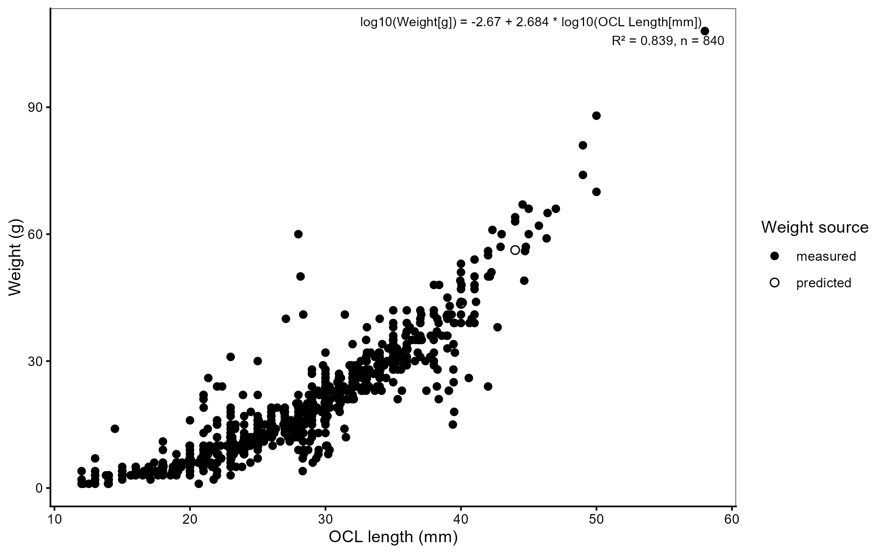

## Chapter 5 — Supplementary information {.unnumbered}

![Depth-resolved water temperature (°C, top) and dissolved oxygen (mg/L, bottom) in Lake Rotoiti throughout the study period (February 2025 – July 2026). Data derived from the LimnoTrack continuous monitoring buoy [@Moore2026]. Vertical green line marks stone pile deployment; dashed vertical lines mark seasonal monitoring rounds. Warm colours in the DO panel (orange–black) indicate hypoxic and anoxic conditions (< 5 mg/L), demonstrating the pronounced summer stratification that compresses oxygenated habitat into the shallow littoral zone.](outputs/fig-lake-conditions.png){#fig-lake-conditions width=100%}

{#fig-length-weight-ch5 width=80%}

{#fig-stone-piles width=80%}

```{r}
#| label: tbl-models-summary-full-supp
#| echo: false
#| tbl-cap: "Full fixed-effect estimates ($\\beta$, SE, 95% CI, p-value) for every term in every model."

tidy_all_full <- readr::read_csv(file.path("outputs", "tbl-models-summary-full.csv"), show_col_types = FALSE)
if (isTRUE(getOption("thesis.is.html")) && knitr::is_html_output()) {
  DT::datatable(tidy_all_full, filter = "top", rownames = FALSE,
                options = list(pageLength = 20, dom = 'Bfrtip', buttons = c('csv', 'excel')),
                extensions = 'Buttons') |>
    DT::formatRound(columns = intersect(names(tidy_all_full),
                                        c("estimate","std.error","statistic","p.value",
                                          "conf.low","conf.high")), digits = 3)
} else if (knitr::is_latex_output()) {
  knitr::kable(tidy_all_full, digits = 3, escape = FALSE, booktabs = TRUE) |>
    kableExtra::kable_styling(
      latex_options  = c("scale_down", "repeat_header", "striped"),
      font_size      = 7,
      stripe_color   = "gray!8"
    ) |>
    kableExtra::landscape()
} else {
  knitr::kable(tidy_all_full, digits = 3)
}
```

```{r}
#| label: tbl-baseline-combined-supp
#| echo: false
#| tbl-cap: "Baseline (pre-construction) comparability of stone pile, control, and reference sites. Values are mean ± SD; p-values test Stone pile vs Control (paired Wilcoxon signed-rank test) and Stone pile vs Reference (unpaired Wilcoxon rank-sum test)."

baseline_combined <- readr::read_csv(file.path("outputs", "tbl-baseline-combined.csv"), show_col_types = FALSE)
col_names_bl <- c("Variable", "Stone pile", "Control", "Reference",
                  "*p* vs Control", "*p* vs Reference")
if (isTRUE(getOption("thesis.is.html")) && knitr::is_html_output()) {
  DT::datatable(baseline_combined, filter = "top", rownames = FALSE,
                colnames = col_names_bl,
                options = list(pageLength = 25, dom = 'Bfrtip', buttons = c('csv', 'excel')),
                extensions = 'Buttons')
} else if (knitr::is_latex_output()) {
  knitr::kable(baseline_combined, digits = 3,
               col.names = col_names_bl, escape = FALSE,
               booktabs = TRUE) |>
    kableExtra::kable_styling(
      latex_options = c("striped", "hold_position"),
      font_size     = 8,
      stripe_color  = "gray!8")
} else {
  knitr::kable(baseline_combined, digits = 3, col.names = col_names_bl)
}
```

```{r}
#| label: tbl-psi-warm-supp
#| echo: false
#| tbl-cap: "Posterior kōura occupancy probability ($\\psi$) from the warm-season occupancy model (Summer and Autumn rounds). Values are population-level estimates averaged over random site effects, with 95 % credible intervals. Autumn has no Before period as baseline monitoring was conducted in summer only."

psi_w <- readr::read_csv(file.path("outputs", "tbl-psi-warm.csv"), show_col_types = FALSE)
if (isTRUE(getOption("thesis.is.html")) && knitr::is_html_output()) {
  psi_display <- psi_w
  names(psi_display) <- c("Season", "Period", "Site type", "ψ (mean [95% CrI])")
  DT::datatable(psi_display, filter = "top", rownames = FALSE,
                options = list(pageLength = 25, dom = 'Bfrtip', buttons = c('csv', 'excel')),
                extensions = 'Buttons')
} else if (knitr::is_latex_output()) {
  knitr::kable(psi_w, align = c("l", "l", "l", "c"),
               col.names = c("Season", "Period", "Site type", "$\\psi$ (mean [95% CrI])"),
               escape = FALSE, booktabs = TRUE) |>
    kableExtra::kable_styling(
      latex_options = c("striped", "hold_position"),
      font_size = 9,
      stripe_color = "gray!8"
    )
} else {
  knitr::kable(psi_w, align = c("l", "l", "l", "c"),
               col.names = c("Season", "Period", "Site type", "$\\psi$ (mean [95% CrI])"),
               escape = FALSE)
}
```

{#fig-power-curves-combined width=100%}

{#fig-convergence-plot width=100%}

{#fig-stone-piles width=100%}
